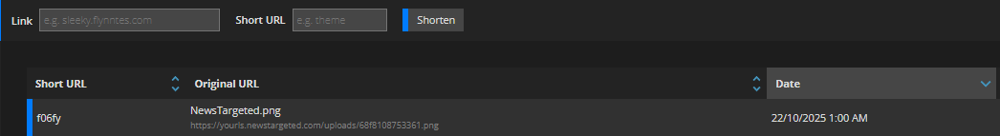
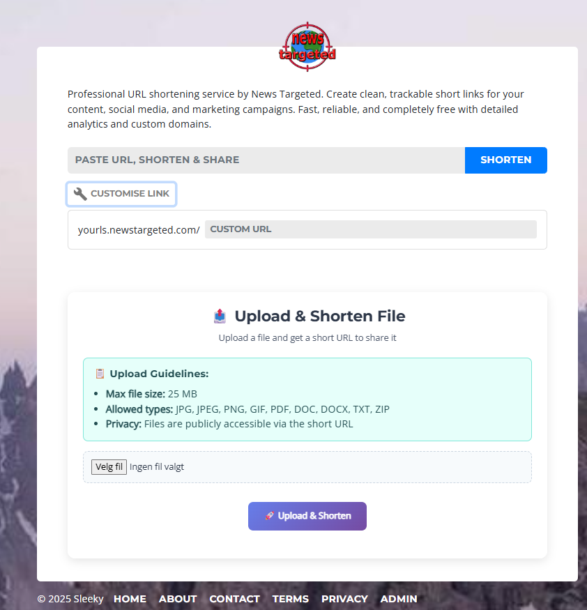
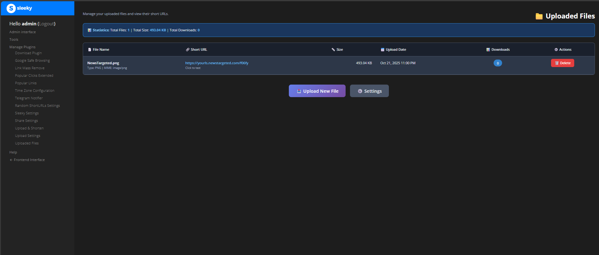

# Upload and Shorten Advanced Plugin for YOURLS

[](https://github.com/YOURLS/awesome)
[](http://yourls.org)
[](https://php.net)
[](#license)
[](#changelog)
[](https://discord.gg/nx9Kzrk)

**Version:** 2.0.0

**Enhanced by:** Master3395 / [News Targeted](https://newstargeted.com/)

**License:** MIT

**YOURLS Compatibility:** 1.7+ (Tested with YOURLS 1.10.2)

A powerful YOURLS plugin that allows you to upload files to your server and automatically create short URLs for them. Perfect for sharing files, documents, images, and more with clean, trackable links.


*Upload files and create short URLs instantly with an intuitive, modern interface*

## Quick Start

### Installation

1. Use the [Download Plugin](https://github.com/krissss/yourls-download-plugin) or manually upload to `/user/plugins/`
2. Activate the plugin in your YOURLS admin panel
3. Configure settings in "Upload Settings" page
4. Start uploading files!

### Basic Setup

1. Set maximum file size (default: 10 MB)
2. Configure allowed file types
3. Choose storage location
4. Enable frontend uploads (optional)
5. Save and test!

## Key Features

- **File Upload & Shortening** - Upload files and get instant short URLs
- **Admin Panel Integration** - Full admin interface with settings management
- **Frontend Upload Support** - Allow public users to upload files (configurable)
- **Multiple Storage Locations** - Configure different storage paths for various needs
- **File Expiration** - Set automatic file cleanup with customizable retention periods
- **Download Tracking** - Track file downloads through YOURLS analytics
- **Advanced Security** - CSRF protection, MIME validation, path traversal prevention, rate limiting
- **Mobile-First Design** - Fully responsive and optimized for all devices
- **Drag & Drop Support** - Modern file upload experience with progress indicators
- **Multi-Language Support** - Available in English, German, French, Spanish, Chinese, and Norwegian

## Features Overview

### Core Functionality

- Upload files and get instant short URLs
- Full admin interface with settings management
- Public upload interface (configurable)
- View, manage, and delete uploaded files
- Track file downloads through YOURLS analytics

### Admin Features

- Configure multiple storage locations
- Set maximum file sizes for uploads
- Control allowed file extensions
- Configure automatic file cleanup
- Enable/disable public uploads
- Bulk file management
- Pagination for large file lists
- Advanced filtering and search


*Seamlessly integrated with YOURLS admin panel for easy management*

### Frontend Features

- Clean, responsive upload form
- Drag & drop file upload
- Real-time progress indicators
- Copy to clipboard functionality
- Mobile responsive design
- Custom upload messages
- Rate limiting per IP


*Beautiful public upload interface with file guidelines and easy-to-use controls*

### Security & Performance

- CSRF protection for secure form submissions
- MIME type and content validation
- Path traversal prevention
- Rate limiting to prevent abuse
- Clean URL support (SEO-friendly)
- Modular code structure (under 500 lines per file)
- Optimized database queries

## Documentation

- [Installation Guide](#installation)
- [Configuration Guide](#configuration)
- [Usage Guide](#usage)
- [Internationalization](#internationalization)
- [Troubleshooting](#troubleshooting)
- [Changelog](#changelog) - [Full Version History](changelogs/README.md)

## Installation

### Option 1: Using Download Plugin (Recommended)

If you have the [Download Plugin](https://github.com/krissss/yourls-download-plugin) installed:

1. Go to your YOURLS admin panel
2. Navigate to the Download Plugin page
3. Paste this URL: `https://github.com/master3395/YOURLS-Upload-and-Shorten-Advanced`
4. Click "Download"
5. The plugin will be automatically installed

Then proceed to step 2 below for permissions and activation.

### Option 2: Manual Installation

```bash
# Navigate to your YOURLS plugins directory
cd /path/to/yourls/user/plugins/

# Clone the plugin
git clone https://github.com/master3395/YOURLS-Upload-and-Shorten-Advanced.git
```

### 2. Set Permissions

```bash
# Set proper ownership and permissions
chown -R yourls_user:yourls_group YOURLS-Upload-and-Shorten-Advanced/
chmod -R 755 YOURLS-Upload-and-Shorten-Advanced/
chmod 777 YOURLS-Upload-and-Shorten-Advanced/uploads/
```

### 3. Activate the Plugin

1. Go to your YOURLS admin panel: `https://yourls.example.com/admin/plugins.php`
2. Find "Upload & Shorten" in the plugin list
3. Click "Activate"
4. The plugin will automatically create necessary database tables

### 4. Configure Settings

1. Navigate to **Upload Settings** in the admin panel
2. Configure your preferred settings (max file size, allowed file types, storage location, frontend upload settings)
3. Save your configuration

## Configuration

### Admin Settings

Access the settings via: **Admin Panel → Plugins → Upload Settings**

| Setting                       | Description                                | Default                               |
| ----------------------------- | ------------------------------------------ | ------------------------------------- |
| **Max File Size**       | Maximum file size for uploads              | 10 MB                                 |
| **Allowed File Types**  | Comma-separated list of allowed extensions | jpg,jpeg,png,gif,pdf,doc,docx,txt,zip |
| **File Retention**      | How long to keep files before deletion     | Never                                 |
| **Storage Location**    | Directory where files are stored           | `/uploads/`                         |
| **Frontend Uploads**    | Allow public users to upload files         | Disabled                              |
| **Frontend Max Size**   | Maximum file size for frontend uploads     | 5 MB                                  |
| **Frontend File Types** | Allowed file types for frontend uploads    | jpg,jpeg,png,gif,pdf,txt              |


*Configure all plugin settings from the intuitive admin interface*

### Storage Locations

The plugin supports multiple storage locations:

- Configure different paths for different file types
- Set per-location size limits
- Enable/disable locations individually
- Monitor storage statistics per location
- Test storage location accessibility

### File Expiration Settings

Configure automatic file cleanup:

- **Never** - Keep files indefinitely
- **24 Hours** - Delete after 1 day
- **7 Days** - Delete after 1 week
- **31 Days** - Delete after 1 month
- **90 Days** - Delete after 3 months
- **Custom** - Set your own retention period

### Security Features

- Files are validated for type and content
- Path traversal attacks are prevented
- CSRF protection is enabled
- Rate limiting prevents abuse
- Upload directory is protected with .htaccess
- Dangerous file extensions are blocked
- Content scanning for malicious code

## Usage

### Admin Upload

1. Go to **Admin Panel → Upload & Shorten**
2. Select a file from your computer
3. Optionally customize short URL and title
4. Choose storage location and expiration
5. Click "Upload & Create Short URL"
6. Get your short URL instantly

### Frontend Upload (if enabled)

1. Visit your YOURLS frontend
2. Use the "Upload & Shorten File" section
3. Select a file and configure options
4. Click "Upload & Shorten"
5. Copy the generated short URL

### File Management

- View all uploaded files in **Admin Panel → Uploaded Files**
- Filter files by type, expiration status, or search
- Delete files individually or in bulk
- Extend file expiration periods
- Monitor download statistics
- View file details and metadata


*Manage all your uploaded files with detailed statistics and easy controls*

## Internationalization

The plugin supports multiple languages:

| Language             | Code      | Status      | Contributor      |
| -------------------- | --------- | ----------- | ---------------- |
| English              | `en_US` | ✅ Complete | Built-in         |
| German               | `de_DE` | ✅ Complete | Fredl            |
| French               | `fr_FR` | ✅ Complete | Alfonso Vivancos |
| Spanish              | `es_ES` | ✅ Complete | Alfonso Vivancos |
| Chinese (Simplified) | `zh_CN` | ✅ Complete | Mo Lun           |
| Norwegian (Bokmål)  | `nb_NO` | ✅ Complete | Master3395       |

To use a specific language, add this to your `user/config.php`:

```php
define('YOURLS_LANG', 'de_DE'); // Replace with your preferred language code
```

## Advanced Configuration

### Custom Storage Location

You can customize where files are stored by modifying the storage location in the admin settings. The path should be:

- **Web-accessible** - Files need to be accessible via HTTP
- **Writable** - The web server must have write permissions
- **Secure** - Protected with .htaccess to prevent PHP execution

### Rate Limiting

Configure rate limits to prevent abuse:

- Set uploads per hour limit
- Per-IP address tracking
- Automatic cleanup of old rate limit data

### File Validation

The plugin validates files on multiple levels:

- File extension checking
- MIME type validation
- Content scanning for malicious code
- Size limit enforcement
- Dangerous extension blocking

## Compatibility

- **YOURLS:** 1.7+
- **PHP:** 7.4 - 8.6
- **Web Servers:** Apache, Nginx, OpenLiteSpeed, LiteSpeed Enterprise
- **Control Panels:** CyberPanel, cPanel, Plesk
- **Tested:** YOURLS 1.10.2 on AlmaLinux 9.6 & 10 with OpenLiteSpeed and LiteSpeed Enterprise

### CyberPanel & LiteSpeed Compatibility

The plugin includes .htaccess rules that are fully compatible with:

- **OpenLiteSpeed** - Standard Apache-compatible directives
- **LiteSpeed Enterprise** - Enhanced with optional LiteSpeed-specific optimizations
- **CyberPanel** - Seamless integration with CyberPanel's file management
- **AlmaLinux** - Tested and optimized for AlmaLinux 9.6 and 10

### Theme Compatibility

This plugin works seamlessly with both default and custom YOURLS themes:

- **Standard YOURLS Theme** - Full compatibility with the default YOURLS interface
- **Sleeky2 Theme** - Fully compatible with [Sleeky2](https://sleeky.flynntes.com/) frontend and backend themes
- **Custom Themes** - Works with most custom YOURLS themes through standard hooks and filters

The plugin's responsive design ensures a great experience regardless of which theme you're using.

## Troubleshooting

### Common Issues

**File uploads not working:**

- Check directory permissions (should be 755 for directories, 644 for files)
- Verify upload directory exists and is writable
- Check PHP upload limits in php.ini (`upload_max_filesize`, `post_max_size`)
- Ensure database tables were created during activation

**Short URLs not redirecting:**

- Ensure the upload directory is web-accessible
- Check that files are being moved to the correct location
- Verify .htaccess rules are working
- Check YOURLS URL rewriting is configured correctly

**Frontend uploads not showing:**

- Check that "Enable Frontend Uploads" is set to "Yes" in admin settings
- Verify the frontend theme is compatible
- Check for JavaScript errors in browser console
- Check for PHP errors in the error log

**Database errors:**

- Verify database tables exist (`yourls_upload_files`, `yourls_upload_settings`)
- Check database user has CREATE and INSERT permissions
- Run the activation function again to create missing tables

### Debug Mode

Enable debug mode by adding this to your `user/config.php`:

```php
define('YOURLS_DEBUG', true);
define('UPLOAD_DEBUG', true); // Plugin-specific debugging
```

Check the log file at: `user/logs/upload-plugin.log`

## Changelog

**Current Version:** 2.0.0 (October 2025)

This release represents a complete rewrite with enhanced security, modern UI/UX, and advanced features including frontend uploads, file expiration, multiple storage locations, and comprehensive admin interface.

**View Full Changelog:** [changelogs/README.md](changelogs/README.md)

### Quick Summary

- ✅ Complete rewrite and modernization
- ✅ Enhanced security with CSRF protection and validation
- ✅ Frontend upload support for public users
- ✅ Multiple storage locations and file expiration
- ✅ Fully responsive mobile-first design
- ✅ Norwegian Bokmål translation added
- ✅ Modular code structure (under 500 lines per file)

For detailed version history and migration guides, see the [changelogs directory](changelogs/).

## Support & Contribution

- **Issues:** [GitHub Issues](https://github.com/master3395/YOURLS-Upload-and-Shorten-Advanced/issues)
- **Discord:** [Join our Discord Server](https://discord.gg/nx9Kzrk)
- **Website:** [newstargeted.com](https://newstargeted.com)
- **Email:** [info@newstargeted.com](mailto:info@newstargeted.com)

### Contributing

We welcome contributions! Here's how you can help:

1. **Report Bugs** - Use the issue tracker to report problems
2. **Suggest Features** - Propose new functionality
3. **Translate** - Help with language translations
4. **Code** - Submit pull requests for improvements
5. **Documentation** - Improve documentation and examples

## Author

### Master3395 / News Targeted

- Website: [newstargeted.com](https://newstargeted.com/)
- Email: [info@newstargeted.com](mailto:info@newstargeted.com)
- GitHub: [@master3395](https://github.com/master3395)

## Credits

- **Original Author**: [mtttmpl](https://github.com/mtttmpl/YOURLS-Plugin--Share-Files) - Creator of the original Share Files plugin
- **Fork Contributors**: [adammatthews](https://github.com/adammatthews/YOURLS-Plugin--Share-Files), [fredl99](https://github.com/fredl99/YOURLS-Upload-and-Shorten)
- **Latest Enhanced Version**: [News Targeted](https://newstargeted.com) - Most updated and feature-rich version
- **Development Lineage**:
  - Original → [mtttmpl/YOURLS-Plugin--Share-Files](https://github.com/mtttmpl/YOURLS-Plugin--Share-Files)
  - Fork → [adammatthews/YOURLS-Plugin--Share-Files](https://github.com/adammatthews/YOURLS-Plugin--Share-Files)
  - Fork → [fredl99/YOURLS-Upload-and-Shorten](https://github.com/fredl99/YOURLS-Upload-and-Shorten)
  - **Enhanced → News Targeted (This Version)**

## License

MIT License - Free to modify and distribute.
