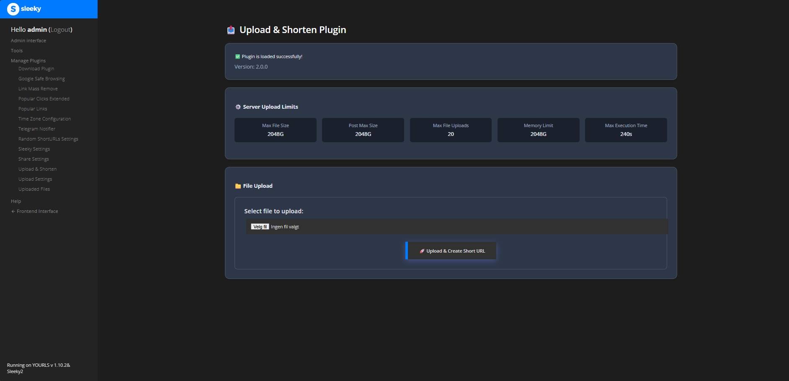
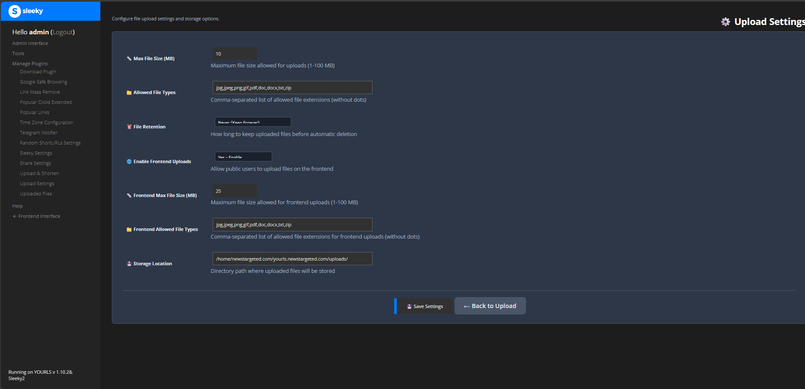

# Upload and Shorten Advanced Plugin for YOURLS

[](https://github.com/YOURLS/awesome)
[](http://yourls.org)
[](https://php.net)
[](#license)
[](#changelog)
[](https://discord.gg/nx9Kzrk)

**Version:** 2.0.0

**Enhanced by:** Master3395 / [News Targeted](https://newstargeted.com/)

**License:** MIT

**YOURLS Compatibility:** 1.7+ (Tested with YOURLS 1.10.2)

A powerful YOURLS plugin that allows you to upload files to your server and automatically create short URLs for them. Perfect for sharing files, documents, images, and more with clean, trackable links.


*Upload files and create short URLs instantly with an intuitive, modern interface*

## Quick Start

### Installation

1. Use the [Download Plugin](https://github.com/krissss/yourls-download-plugin) or manually upload to `/user/plugins/`
2. Activate the plugin in your YOURLS admin panel
3. Configure settings in "Upload Settings" page
4. Start uploading files!

### Basic Setup

1. Set maximum file size (default: 10 MB)
2. Configure allowed file types
3. Choose storage location
4. Enable frontend uploads (optional)
5. Save and test!

## Key Features

- **File Upload & Shortening** - Upload files and get instant short URLs
- **Admin Panel Integration** - Full admin interface with settings management
- **Frontend Upload Support** - Allow public users to upload files (configurable)
- **Multiple Storage Locations** - Configure different storage paths for various needs
- **File Expiration** - Set automatic file cleanup with customizable retention periods
- **Download Tracking** - Track file downloads through YOURLS analytics
- **Advanced Security** - CSRF protection, MIME validation, path traversal prevention, rate limiting
- **Mobile-First Design** - Fully responsive and optimized for all devices
- **Drag & Drop Support** - Modern file upload experience with progress indicators
- **Multi-Language Support** - Available in English, German, French, Spanish, Chinese, and Norwegian

## Features Overview

### Core Functionality

- Upload files and get instant short URLs
- Full admin interface with settings management
- Public upload interface (configurable)
- View, manage, and delete uploaded files
- Track file downloads through YOURLS analytics

### Admin Features

- Configure multiple storage locations
- Set maximum file sizes for uploads
- Control allowed file extensions
- Configure automatic file cleanup
- Enable/disable public uploads
- Bulk file management
- Pagination for large file lists
- Advanced filtering and search


*Seamlessly integrated with YOURLS admin panel for easy management*

### Frontend Features

- Clean, responsive upload form
- Drag & drop file upload
- Real-time progress indicators
- Copy to clipboard functionality
- Mobile responsive design
- Custom upload messages
- Rate limiting per IP


*Beautiful public upload interface with file guidelines and easy-to-use controls*

### Security & Performance

- CSRF protection for secure form submissions
- MIME type and content validation
- Path traversal prevention
- Rate limiting to prevent abuse
- Clean URL support (SEO-friendly)
- Modular code structure (under 500 lines per file)
- Optimized database queries

## Documentation

- [Installation Guide](guides/installation.md) - Complete installation instructions
- [Configuration Guide](guides/configuration.md) - Settings and options
- [Usage Guide](guides/usage.md) - How to use the plugin
- [Advanced Configuration](guides/advanced-configuration.md) - Custom setups
- [Internationalization](guides/internationalization.md) - Language support
- [Troubleshooting Guide](guides/troubleshooting.md) - Common issues
- [Changelog](changelogs/README.md) - Version history and updates

## Installation

See the complete [Installation Guide](guides/installation.md) for detailed instructions.

### Quick Install

1. Install via [Download Plugin](https://github.com/krissss/yourls-download-plugin) or clone to `/user/plugins/`
2. Set directory permissions (755 for plugin, 777 for uploads)
3. Activate in YOURLS admin panel
4. Configure settings

For detailed steps, troubleshooting, and server-specific instructions, see the [Installation Guide](guides/installation.md).

## Configuration

Configure the plugin through **Admin Panel → Upload Settings**. See the [Configuration Guide](guides/configuration.md) for detailed settings documentation.


*Configure all plugin settings from the intuitive admin interface*

### Key Settings

- **File Upload Limits** - Max size and allowed types
- **Storage Locations** - Multiple storage paths with individual settings
- **File Expiration** - Automatic cleanup (24 hours to never)
- **Frontend Uploads** - Public upload controls and restrictions
- **Security** - CSRF protection, MIME validation, rate limiting

For complete configuration details, including advanced options and security settings, see the [Configuration Guide](guides/configuration.md).

## Usage

See the complete [Usage Guide](guides/usage.md) for detailed instructions.

### Quick Usage

**Admin Upload:**
1. Go to **Upload & Shorten** in admin panel
2. Select file, customize options
3. Get instant short URL

**Frontend Upload** (if enabled):
1. Visit YOURLS homepage
2. Use upload form
3. Share generated short URL

**File Management:**
- View, search, and filter files in admin panel
- Track downloads and statistics
- Bulk operations and expiration management


*Manage all your uploaded files with detailed statistics and easy controls*

For detailed workflows, best practices, and advanced features, see the [Usage Guide](guides/usage.md).

## Internationalization

The plugin is available in 6 languages. See the [Internationalization Guide](guides/internationalization.md) for details.

**Supported:** English, German, French, Spanish, Chinese (Simplified), Norwegian (Bokmål)

Configure in `user/config.php`:
```php
define('YOURLS_LANG', 'nb_NO'); // Use your language code
```

Want to contribute a translation? See the [Internationalization Guide](guides/internationalization.md).


## Compatibility

- **YOURLS:** 1.7+
- **PHP:** 7.4 - 8.6
- **Web Servers:** Apache, Nginx, OpenLiteSpeed, LiteSpeed Enterprise
- **Control Panels:** CyberPanel, cPanel, Plesk
- **Tested:** YOURLS 1.10.2 on AlmaLinux 9.6 & 10 with OpenLiteSpeed and LiteSpeed Enterprise

### CyberPanel & LiteSpeed Compatibility

The plugin includes .htaccess rules that are fully compatible with:

- **OpenLiteSpeed** - Standard Apache-compatible directives
- **LiteSpeed Enterprise** - Enhanced with optional LiteSpeed-specific optimizations
- **CyberPanel** - Seamless integration with CyberPanel's file management
- **AlmaLinux** - Tested and optimized for AlmaLinux 9.6 and 10

### Theme Compatibility

This plugin works seamlessly with both default and custom YOURLS themes:

- **Standard YOURLS Theme** - Full compatibility with the default YOURLS interface
- **Sleeky2 Theme** - Fully compatible with [Sleeky2](https://sleeky.flynntes.com/) frontend and backend themes
- **Custom Themes** - Works with most custom YOURLS themes through standard hooks and filters

The plugin's responsive design ensures a great experience regardless of which theme you're using.

## Troubleshooting

Having issues? See the [Troubleshooting Guide](guides/troubleshooting.md) for solutions.

### Common Issues

- **File uploads not working** - Check permissions and PHP limits
- **Short URLs not redirecting** - Verify file location and .htaccess
- **Frontend uploads not showing** - Check settings and theme compatibility
- **Database errors** - Verify tables and permissions

### Debug Mode

```php
// Add to user/config.php
define('YOURLS_DEBUG', true);
define('UPLOAD_DEBUG', true);
```

For detailed solutions and debug instructions, see the [Troubleshooting Guide](guides/troubleshooting.md).

## Changelog

**Current Version:** 2.0.0 (October 2025)

Complete rewrite with enhanced security, modern UI/UX, frontend uploads, file expiration, multiple storage locations, and comprehensive admin interface.

View complete version history and release notes in the [changelogs directory](changelogs/).

## Support & Contribution

- **Issues:** [GitHub Issues](https://github.com/master3395/YOURLS-Upload-and-Shorten-Advanced/issues)
- **Discord:** [Join our Discord Server](https://discord.gg/nx9Kzrk)
- **Website:** [newstargeted.com](https://newstargeted.com)
- **Email:** [info@newstargeted.com](mailto:info@newstargeted.com)

### Contributing

We welcome contributions! Here's how you can help:

1. **Report Bugs** - Use the issue tracker to report problems
2. **Suggest Features** - Propose new functionality
3. **Translate** - Help with language translations
4. **Code** - Submit pull requests for improvements
5. **Documentation** - Improve documentation and examples

## Author

### Master3395 / News Targeted

- Website: [newstargeted.com](https://newstargeted.com/)
- Email: [info@newstargeted.com](mailto:info@newstargeted.com)
- GitHub: [@master3395](https://github.com/master3395)

## Credits

**Enhanced by:** Master3395 / [News Targeted](https://newstargeted.com)

For complete development history, original authors, and contributor credits, see the [Version 1.0.0 Changelog](changelogs/v1.0.0.md).

## License

MIT License - Free to modify and distribute.
