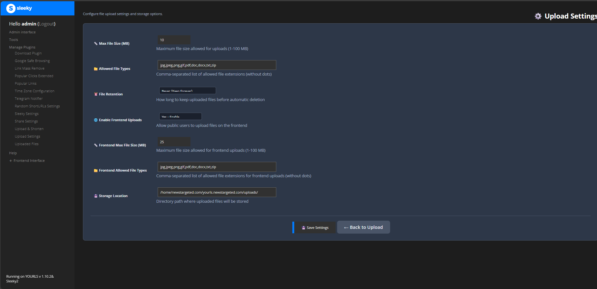

# Configuration Guide

Detailed configuration options for the Upload and Shorten Advanced plugin.

## Accessing Settings

Access the settings via: **Admin Panel → Plugins → Upload Settings**

## Admin Settings

### Basic Configuration

| Setting | Description | Default | Notes |
|---------|-------------|---------|-------|
| **Max File Size** | Maximum file size for uploads | 10 MB | Can be increased up to PHP's `upload_max_filesize` limit |
| **Allowed File Types** | Comma-separated list of allowed extensions | jpg,jpeg,png,gif,pdf,doc,docx,txt,zip | Case-insensitive |
| **File Retention** | How long to keep files before deletion | Never | Options: Never, 24 Hours, 7 Days, 31 Days, 90 Days, Custom |
| **Storage Location** | Directory where files are stored | `/uploads/` | Must be web-accessible and writable |

### Frontend Upload Settings

| Setting | Description | Default | Notes |
|---------|-------------|---------|-------|
| **Frontend Uploads** | Allow public users to upload files | Disabled | Enable with caution |
| **Frontend Max Size** | Maximum file size for frontend uploads | 5 MB | Should be lower than admin limit |
| **Frontend File Types** | Allowed file types for frontend uploads | jpg,jpeg,png,gif,pdf,txt | Should be more restrictive than admin |


*Configure all plugin settings from the intuitive admin interface*

## Storage Locations

The plugin supports multiple storage locations for organizing your files.

### Configuring Storage Locations

1. Navigate to **Upload Settings** in admin panel
2. Click "Add Storage Location"
3. Configure the following:
   - **Location Name** - Descriptive name for the storage location
   - **Directory Path** - Relative or absolute path to storage directory
   - **Max File Size** - Size limit for this location
   - **Allowed Types** - File types allowed in this location
   - **Public Access** - Whether files are publicly accessible

### Storage Location Features

- Configure different paths for different file types
- Set per-location size limits
- Enable/disable locations individually
- Monitor storage statistics per location
- Test storage location accessibility before saving

### Best Practices

- Use separate locations for images, documents, and archives
- Set appropriate size limits for each location
- Regularly monitor storage usage
- Test accessibility after configuration changes

## File Expiration Settings

Configure automatic file cleanup to manage storage space.

### Available Retention Periods

- **Never** - Keep files indefinitely (default)
- **24 Hours** - Delete after 1 day (good for temporary shares)
- **7 Days** - Delete after 1 week (good for short-term sharing)
- **31 Days** - Delete after 1 month (balanced approach)
- **90 Days** - Delete after 3 months (longer retention)
- **Custom** - Set your own retention period in days

### How It Works

1. Files are marked with an expiration date on upload
2. A daily cron job checks for expired files
3. Expired files are automatically deleted from storage
4. Associated short URLs are removed from database
5. Statistics are updated accordingly

### Setting Up Automatic Cleanup

The plugin includes a built-in cleanup routine that runs when:
- The admin panel is accessed
- A new file is uploaded
- Settings are saved

For more reliable cleanup, set up a cron job:

```bash
# Add to your crontab
0 2 * * * /usr/bin/php /path/to/yourls/user/plugins/YOURLS-Upload-and-Shorten-Advanced/cleanup.php
```

## Security Features

The plugin includes multiple security layers to protect your installation.

### Built-in Security

- **CSRF Protection** - All forms include CSRF tokens
- **MIME Validation** - Files are validated by content, not just extension
- **Path Traversal Prevention** - Prevents directory traversal attacks
- **Rate Limiting** - Prevents abuse with per-IP upload limits
- **Content Scanning** - Detects malicious code in uploads
- **Dangerous Extension Blocking** - Blocks potentially harmful file types

### File Validation

Files are validated on multiple levels:

1. **Extension Checking** - Verifies file extension is allowed
2. **MIME Type Validation** - Checks actual file content type
3. **Content Scanning** - Scans file content for malicious code
4. **Size Limit Enforcement** - Ensures file doesn't exceed limits
5. **Dangerous Extension Blocking** - Blocks executables and scripts

### Protected File Types

The following extensions are always blocked for security:

- Executables: `.exe`, `.com`, `.bat`, `.cmd`, `.sh`
- Scripts: `.php`, `.asp`, `.aspx`, `.jsp`, `.py`, `.rb`
- Archives with executables: `.jar`, `.war`
- System files: `.dll`, `.so`, `.dylib`

### Upload Directory Protection

The plugin automatically creates a `.htaccess` file in the upload directory with:

```apache
# Prevent PHP execution
<Files *.php>
    deny from all
</Files>

# Block dangerous file types
<FilesMatch "\.(exe|com|bat|cmd|sh|dll|so|dylib)$">
    deny from all
</FilesMatch>

# Allow only specified file types
<FilesMatch "\.(jpg|jpeg|png|gif|pdf|doc|docx|txt|zip)$">
    Allow from all
</FilesMatch>
```

## PHP Configuration

Ensure your PHP configuration supports file uploads:

### Required php.ini Settings

```ini
file_uploads = On
upload_max_filesize = 20M     # Adjust as needed
post_max_size = 25M           # Should be larger than upload_max_filesize
max_execution_time = 300      # For large file uploads
memory_limit = 256M           # For processing large files
```

### Checking Current Limits

You can check your current PHP limits in the Upload Settings page, which displays:
- Maximum upload size
- Maximum post size
- Memory limit
- Execution time limit

## Database Configuration

The plugin creates two database tables:

- `yourls_upload_files` - Stores file metadata
- `yourls_upload_settings` - Stores plugin configuration

These tables are created automatically on plugin activation.

## Next Steps

- [Learn how to use the plugin](usage.md)
- [Set up advanced features](advanced-configuration.md)
- [Configure multiple languages](internationalization.md)

## Back to Guides

[← Back to Documentation Index](README.md)

